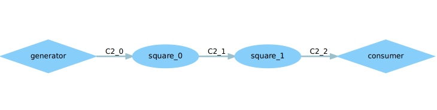
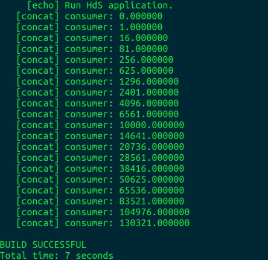
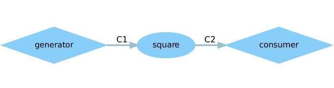
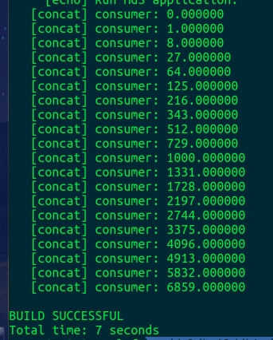

# DOL实例分析&编程

> 李泽帆 14M2 14353157

## 任务

### 修改example2，让3个square模块变成2个



修改xml：

将迭代次数降低为2就行了

```xml
<variable value="2" name="N"/>
```




### 修改example1，使其输出3次方数




修改square.c：
只需要将原本的i = i*i改成立方的

```c
i = i*i*i;
```



## 实验感想

这次实验主要在于熟悉DOL的编程规范，理解分布式系统是如何运行的，可以从.dot文件清楚的看清整个结构。

