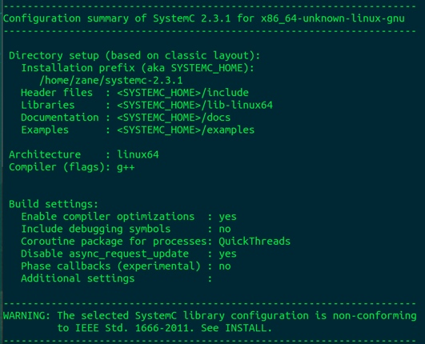
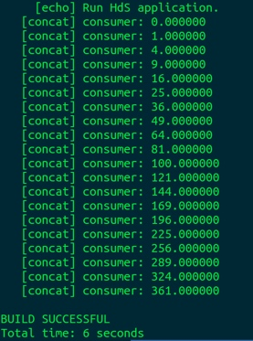

# 嵌入式开发 DOL
[TOC]

## Description
Distributed Operation Layer :

The distributed operation layer (DOL) is a software development framework to program parallel applications. The DOL allows to specify applications based on the Kahn process network model of computation and features a simulation engine based on SystemC. Moreover, the DOL provides an XML-based specification format to describe the implementation of a parallel application on a multi-processor systems, including binding and mapping

## How to install
### Setup environments & get files:
```shell
sudo apt-get update
sudo apt-get install ant
sudo apt-get install openjdk-7-jdk
sudo apt-get install unzip
```

```shell
sudo wget http://www.accellera.org/images/downloads/standards/systemc/systemc-2.3.1.tgz
sudo wget http://www.tik.ee.ethz.ch/~shapes/downloads/dol_ethz.zip

mkdir dol
unzip dol_ethz.zip -d dol
tar -zxvf systemc-2.3.1.tgz
```

### Compile systemc

```shell
cd systemc-2.3.1
mkdir objdir
cd objdir
../configure CXX=g++ --disable-async-updates
sudo make install
```
*Note: Mark down the current path, if you don't know, run `pwd`*




### Compile dol

```shell
cd ../dol
vim build_zip.xml
```
Find the following text and change it (where YYY is the path we marked down just now).

```
<property name="systemc.inc" value="YYY/include"/>
<property name="systemc.lib" value="YYY/lib-linux/libsystemc.a"/>
```

*Notice: if your computer runs in 64-bits, you may need to change `lib-linux` to `lib-linux64`*

```
ant -f build_zip.xml all
```


After finishing install, you can run a simple example to ensure it all work well.

```
cd build/bin/main
ant -f runexample.xml -Dnumber=1
```
If you can see something as the following image, you've done.



## Experimental experience
搭建了虚拟机并在虚拟机上面编译安装**Dol**,并使用github对这个实验报告进行递归更新，对这种方法表示5个赞。

