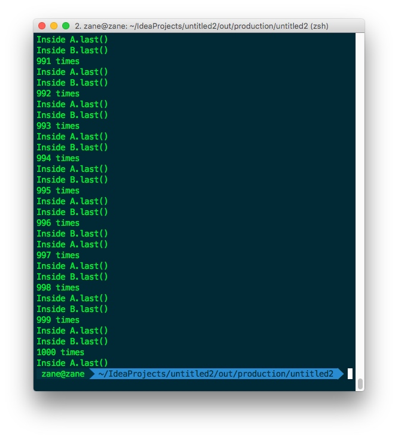
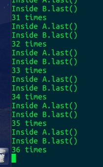

# Embedded System Lab 死锁 
> 李泽帆 14M2 14353157

[TOC]

## 死锁停在第几次的截图

一开始悲剧了，在自己电脑上面跑一直进不了死锁

后来拿去虚拟机上面跑终于出现了～

## 产生死锁的4个必要条件

- 互斥：一个资源一个时间点只能提供给一个进程
- 不可强占：资源申请者不能强行的从资源占有者手中夺取资源，资源只能由占有者自愿释放 
- 请求和保持：一个进程在申请新的资源的同时保持对原有资源的占有（只有这样才是动态申请，动态分配） 
- 循环等待：存在一个循环的进程等待队列

## 对上述程序产生死锁的解释

当在一个时间点`a.methodA(b);`刚被调用后的一瞬间，这时候刚好`Thread T`被unblock，它就会运行`b.methodB(a);`，接下去它发现它拿不到a的资源，因为是synchronized的，他就被block掉了，换main Thread运行，这是a也发现发不到b的资源，从而产生死锁，CPU资源一直在这两个线程之间切换，频繁调度，但却都没法继续运行。

